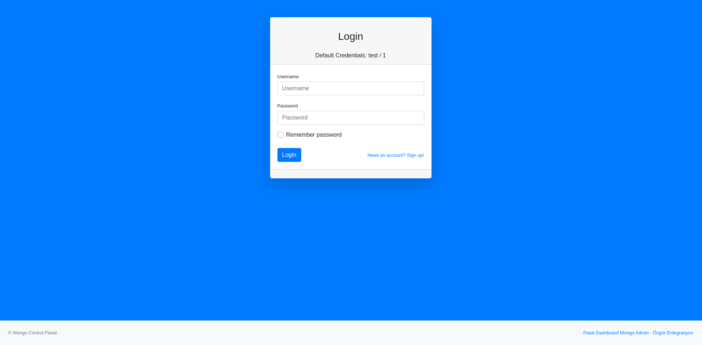
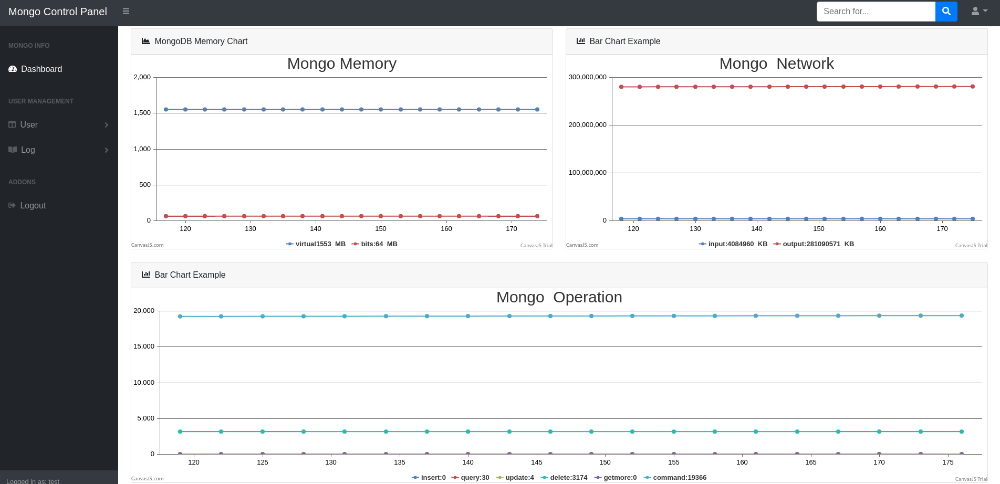
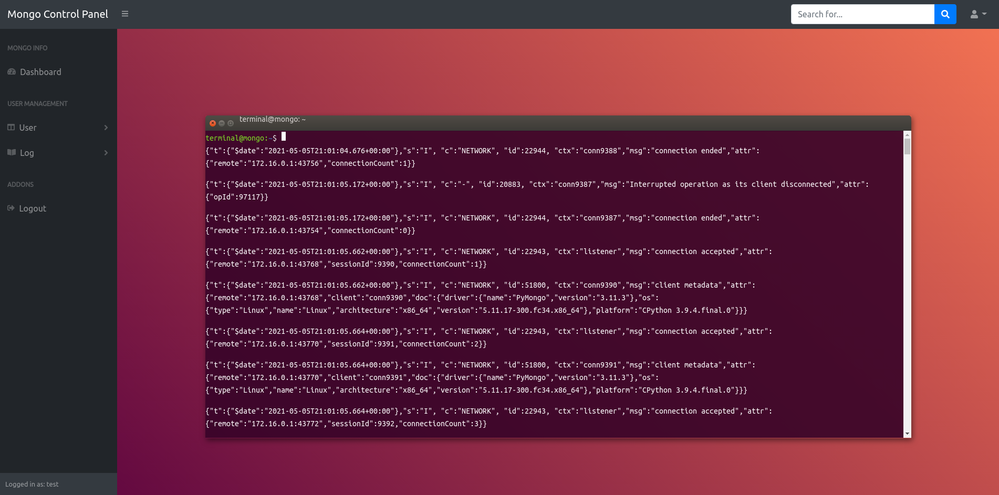
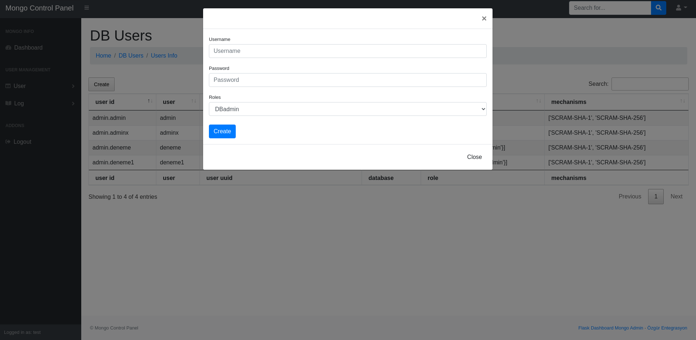

## Nedir?

PyMongo kütüphanesi ve mükemmel flask çatısı birazda websocket kullanarak oluşturulmuş bir kontrol panel. Basit çok basit bir şekilde yazıldı. Bir çok eksikliği mevcut. Hafta sonu hobi projesi...

### Neler Yapar

MongoDb nin network, memory, operationlarını anlık olarak izler ve canvasjs yardımıyla grafiğe döker. Kullanıcı oluşturur(ama rol tanımlaması kısımlarını yapmadım o kısmın çok eksiği var). Connection listesini tablo şeklinde sunar. Document ve collectionları görüntüler. Collectionları siler. Global ve setwarning Loglarını websocket yardımıyla görüntüler.

### Neler Yapıcaz

- Ldap otantikasyonu
- CRUD işlemleri
- Backup ( çalışmalar Başladı)
- Hata Loglarının kaydı

## Başlarken

```markdown
pip3 install -r requirements.txt

```

## init Dosyanı kendinize göre Düzenleyin
```python


mongo_client = MongoClient()
mongo_client = MongoClient('mongodb://172.16.0.11:27017/')

db = SQLAlchemy()
login_manager = LoginManager()

def register_extensions(app):
    db.init_app(app)
    login_manager.init_app(app)

def register_blueprints(app):
    for module_name in ('base', 'home'):
        module = import_module('app.{}.routes'.format(module_name))
        app.register_blueprint(module.blueprint)


def websocketThread(app):
    sockets = Sockets(app)
    sockets.register_blueprint(ws, url_prefix=r'/')


def configure_database(app):

    @app.before_first_request
    def initialize_database():
        db.create_all()

    @app.teardown_request
    def shutdown_session(exception=None):
        db.session.remove()

def create_app(config):
    app = Flask(__name__, static_folder='base/static')
    app.config.from_object(config)
    register_extensions(app)
    register_blueprints(app)
    configure_database(app)
    CORS(app)
    websocketThread(app)
    return app


```

```sh
python3 run.py
```
###  Giriş Ekranı


###  Monitor Ekranı


###  Log Ekranı


### Kullanıcı Ekleme Ekranı



